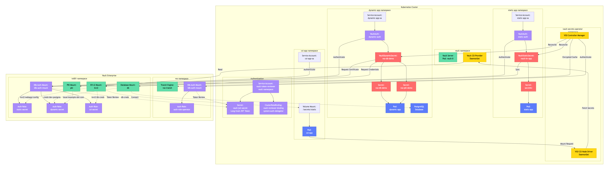

# Vault Secrets Operator for Kubernetes

This repository demonstrates HashiCorp Vault Secrets Operator (VSO) integration with Kubernetes, showcasing static secrets, dynamic secrets, and CSI driver functionality with automated workflows.

## Overview

The Vault Secrets Operator enables Kubernetes applications to consume secrets from HashiCorp Vault through native Kubernetes resources. This project includes complete automation for deploying and managing Vault with VSO on both Minikube and Amazon EKS.

## Features

- Static KV secrets synchronization with VaultStaticSecret resources
- Dynamic database credentials with automatic rotation
- PKI certificate generation and management
- CSI driver integration for volume-mounted secrets
- JWT authentication with Kubernetes service accounts
- Encrypted client cache using Vault Transit engine
- Automated deployment and teardown workflows

## Prerequisites

### Vault Enterprise License
A Vault Enterprise license is required for this lab. You must place a valid `vault-license.lic` file in the `vault-ent/` directory before running the installation tasks.
This enables vault namespace and vault secrets operator csi features.

```bash
vault-ent/
└── vault-license.lic  # Required: Your Vault Enterprise license file
```

The license file is automatically loaded during Vault configuration via the `task config:vault` command.

### Required Tools

Install the following tools:

- kubectl
- helm
- minikube (for local development)
- jq
- task (taskfile.dev)
- AWS CLI (for EKS deployments)
- Terraform (for EKS infrastructure)

## Quick Start

### Local Development with Minikube

```bash
# Start minikube cluster
task minikube
task install
task secrets
task verify
```

### Amazon EKS Deployment

```bash
# Deploy complete EKS infrastructure and install Vault/VSO
task eks:all
task install
task secrets
task verify
```

## Project Structure

```
.
├── Taskfile.yml                    # Task automation definitions
├── vault-ent/                      # Vault Enterprise configurations
│   ├── static-secrets/            # Static secret manifests
│   ├── dynamic-secrets/           # Dynamic secret manifests
│   └── csi/                       # CSI driver configurations
└── eks/                           # EKS infrastructure (Terraform)
```

## Architecture

### Architecture Diagram



### Authentication Model

The project uses a centralized JWT token reviewer service account:

- Service Account: `vault-token-reviewer` in `vault` namespace
- ClusterRoleBinding: `vault-reviewer-binding` with `system:auth-delegator` role
- Token Secret: `vault-jwt-secret` (long-lived service account token)
- All Kubernetes auth mounts use this token for authentication

#### Authentication Flow
1. **JWT Token Reviewer**: A centralized service account with `system:auth-delegator` permissions provides a long-lived JWT token
2. **All Kubernetes auth mounts** in Vault (both `vso` and `tn001` namespaces) use this token for token review operations
3. **Application service accounts** authenticate to Vault using their own service account tokens, which Vault validates using the JWT token reviewer

#### Static Secrets Flow
1. VSO controller watches `VaultStaticSecret` resources
2. Application service account (`static-app-sa`) authenticates via `VaultAuth` to Vault's `k8s-auth-mount` in `tn001` namespace
3. VSO reads secrets from `kvv2/webapp/config` path
4. Secrets are synced to Kubernetes `Secret` resource (`secretkv`)
5. Application pod mounts the secret as environment variables and to `/secrets/static` volume mount

#### Dynamic Secrets Flow
1. VSO controller watches `VaultDynamicSecret` resources
2. Application service account (`dynamic-app-sa`) authenticates via `VaultAuth`
3. VSO requests:
   - Dynamic database credentials from `db/creds/dev-postgres`
   - PKI certificates from `pki/issue/example-dot-com`
4. Credentials are synced to Kubernetes `Secret` resources
5. Application pod mounts database credentials to `/secrets/static` and PKI certificates to `/secrets/tls` volume mounts
6. Credentials automatically rotate based on TTL

#### CSI Driver Flow
1. Application pod defines CSI volume with `SecretProviderClass`
2. CSI node driver intercepts mount request
3. Application service account (`csi-app-sa`) authenticates to Vault
4. Vault CSI Provider fetches secrets from `kvv2/db-creds`
5. Secrets are mounted directly to pod filesystem at `/secrets/static`
6. No Kubernetes `Secret` resource is created

#### Encrypted Client Cache
1. VSO controller authenticates to Vault's `vso` namespace
2. Uses Transit engine (`vso-transit`) to encrypt cached client data
3. Improves performance and reduces Vault API calls

### Namespaces

- `vault` - Vault and CSI provider pods
- `vault-secrets-operator` - VSO controller
- `static-app` - Static KV secrets demonstration
- `dynamic-app` - Dynamic database and PKI secrets demonstration
- `csi-app` - CSI driver integration demonstration

### Vault Configuration

**Namespaces:**
- `vso` - VSO configuration and transit encryption
- `tn001` - Application secrets (static, dynamic, CSI)

**Static Secrets:**
- Namespace: `tn001`
- Mount: `kvv2`
- Path: `kvv2/webapp/config`
- Auth role: `static-secret`
- Service account: `static-app-sa`

**Dynamic Database Secrets:**
- Namespace: `tn001`
- Mount: `db`
- Path: `creds/dev-postgres`
- Auth role: `dynamic-secret`
- Service account: `dynamic-app-sa`
- PostgreSQL deployment included

**PKI Secrets:**
- Namespace: `tn001`
- Mount: `pki`
- Role: `example-dot-com`

**CSI Driver:**
- Namespace: `tn001`
- Mount: `kvv2`
- Path: `db-creds`
- Auth role: `csi-secret`
- Service account: `csi-app-sa`

**Encrypted Client Cache:**
- Namespace: `vso`
- Transit engine: `vso-transit`
- Key: `vso-client-cache`
- Auth role: `auth-role-operator`

## Common Tasks

### Installation and Setup

```bash
# Complete installation
task install

# Install Vault only
task install:vault

# Install VSO only
task install:vso

# Configure Vault
task config:vault

# Deploy all secret types
task secrets
```

### Verification

```bash
# Verify all components
task verify

# Check pod status
task verify:pods

# Verify static secrets
task verify:static-secret

# Verify dynamic secrets
task verify:dynamic-secret

# Verify CSI integration
task verify:csi-secret
```

### Debugging

```bash
# Check Vault status
task status

# View Vault logs
task logs

# View VSO logs
task logs:vso

# Port forward Vault UI
task port-forward

# Open Vault UI with root token
task ui

# Check Kubernetes auth configuration
task list:k8s-auth

# View events
task events
```

### Cleanup

```bash
# Uninstall VSO and Vault
task uninstall

# Delete only application namespaces
task clean:namespaces

# Destroy Minikube cluster
task clean

# Destroy EKS cluster (automated)
task eks:destroy:auto
```


## Verification Commands

### Check Pod Health

```bash
# All pods across all namespaces
kubectl get pods -A

# Specific namespace
kubectl get pods -n vault
kubectl get pods -n vault-secrets-operator
kubectl get pods -n static-app
kubectl get pods -n dynamic-app
kubectl get pods -n csi-app
```

### Check Vault Resources

```bash
# VaultStaticSecret resources
kubectl get vaultstaticsecret -A
kubectl describe vaultstaticsecret vault-kv-app -n static-app

# VaultDynamicSecret resources
kubectl get vaultdynamicsecret -A
kubectl describe vaultdynamicsecret vso-db-demo -n dynamic-app

# VaultAuth resources
kubectl get vaultauth -A

# VaultConnection resources
kubectl get vaultconnection -A
```

### Check Synced Secrets

```bash
# Static secrets
kubectl get secret secretkv -n static-app
kubectl describe secret secretkv -n static-app

# Dynamic secrets
kubectl get secret vso-db-demo -n dynamic-app
kubectl get secret vso-pki-demo -n dynamic-app
```

### View Application Logs

```bash
# Static app
kubectl logs -n static-app -l app=static-app

# Dynamic app
kubectl logs -n dynamic-app -l app=dynamic-app

# CSI app
kubectl logs -n csi-app -l app=csi-app
```

## Troubleshooting

### Pod Issues

```bash
# Check pod status
kubectl get pods -A

# Describe problematic pod
kubectl describe pod <pod-name> -n <namespace>

# Check logs
kubectl logs <pod-name> -n <namespace>

# Check events
kubectl get events -n <namespace> --sort-by='.lastTimestamp'
```


### VSO Issues

```bash
# Check operator logs
task logs:vso

# Verify VaultConnection
kubectl get vaultconnection -A
kubectl describe vaultconnection -n <namespace>

# Verify VaultAuth
kubectl get vaultauth -A
kubectl describe vaultauth -n <namespace>

# Verify secret sync
kubectl describe vaultstaticsecret <name> -n <namespace>
kubectl describe vaultdynamicsecret <name> -n <namespace>
```

### Common Problems

**Pods not starting:**
- Check events: `kubectl get events -A --sort-by='.lastTimestamp'`
- Verify PVC status: `kubectl get pvc -A`
- Check node resources: `kubectl top nodes`

**Secrets not syncing:**
- Verify VaultAuth status: `kubectl describe vaultauth -n <namespace>`
- Check VSO logs: `task logs:vso`
- Verify Vault policies: `task list:k8s-auth`

**CSI secrets not mounting:**
- Check CSI provider logs: `kubectl logs -n vault -l app.kubernetes.io/name=vault-csi-provider`
- Verify CSI node driver: `kubectl get pods -n vault-secrets-operator -l app.kubernetes.io/name=vault-secrets-operator-csi`

## Environment Configuration

The project uses a `.env` file for sensitive configuration:

```bash
VAULT_TOKEN=<root-token>
```

This file is automatically created and populated by `task init:vault` and is excluded from git.

## Security Notes

- All Vault initialization keys are stored in `vault-init.json` (excluded from git)
- Root token is automatically added to `.env` file
- JWT token reviewer uses long-lived service account token for cluster persistence
- Never commit `.env` or `vault-init.json` files
- Use appropriate RBAC policies in production environments
- Rotate secrets regularly using `task rotate:static-secret`

## License

This project is provided as-is for educational purposes.

## Resources

- [Vault Secrets Operator Documentation](https://developer.hashicorp.com/vault/docs/platform/k8s/vso)
- [Vault Kubernetes Auth Method](https://developer.hashicorp.com/vault/docs/auth/kubernetes)
- [Vault CSI Provider](https://developer.hashicorp.com/vault/docs/platform/k8s/csi)
- [HashiCorp Developer Tutorials](https://developer.hashicorp.com/vault/tutorials/kubernetes)