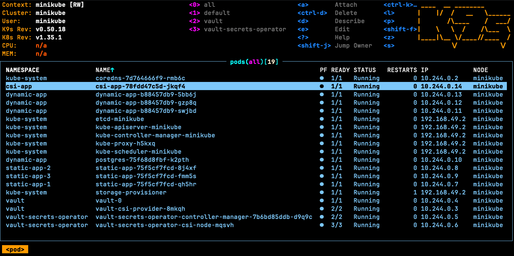

# Vault Secrets Operator for Kubernetes

This repository demonstrates HashiCorp Vault Secrets Operator (VSO) on Kubernetes, with one worked
example per secret-delivery pattern and `task` automation for Minikube, Amazon EKS and Google GKE.



## Examples

Each example lives in `vault-ent/` and has its own walkthrough with an architecture diagram, its Vault
configuration, and its synchronization flow:

- **[Static Secrets](docs/static-secrets.md)** - KV v2 secret synced to a Kubernetes `Secret` across
  several namespaces via one glob-matched Vault role
- **[Dynamic Secrets](docs/dynamic-secrets.md)** - Leased PostgreSQL credentials and PKI certificates
  generated on demand
- **[CSI Secrets](docs/csi-secrets.md)** - Secrets mounted straight into the pod filesystem, with no
  Kubernetes `Secret` created
- **[Shared PKI Secrets](docs/pki-secrets.md)** - One shared `VaultAuth` and service account issuing a
  certificate per namespace
- **[Entity Metadata Secrets](docs/entity-secrets.md)** - Pre-created Vault identity entities carry
  application, team and business-unit metadata, so Vault usage can be traced back to each app for
  chargeback; a templated policy also uses the `team` value to scope secret access
- **[Vault Agent Sidecar](docs/vault-agent-secrets.md)** *(optional)* - Secret delivered as a rendered
  file by an Agent init container, without VSO

All examples run in the `tn001` Vault Enterprise namespace; VSO's encrypted client cache uses the
Transit engine in the `vso` namespace.

## Documentation

- **[Architecture](docs/architecture.md)** - Components, Vault namespaces and engines, the
  authentication model, and platform-specific storage classes
- **[Cloud Deployment](docs/cloud-deployment.md)** - Provisioning and tearing down EKS or GKE with
  Terraform
- **[Troubleshooting](docs/troubleshooting.md)** - Symptoms and fixes for each example
- **Task reference** - run `task --list`

## Prerequisites

### Vault Enterprise License

A Vault Enterprise license is required: it enables Vault namespaces and the VSO CSI features. Place a
valid license file in `vault-ent/` before installing; `task install:vault` loads it into the cluster.

```bash
vault-ent/
└── vault-license.lic  # Required: Vault Enterprise license file
```

### Required Tools

- kubectl
- helm
- jq
- task ([taskfile.dev](https://taskfile.dev))
- minikube (local), or Terraform CLI plus AWS CLI (EKS) / Google Cloud CLI (GKE)

`task prerequisites` checks the core tools.

## Quick Start

### Minikube

```bash
# Complete setup: prerequisites, minikube, Vault + VSO, all examples
task all

# Or step-by-step
task minikube   # start minikube (skipped if already running)
task install    # install, initialise, unseal and configure Vault, then install VSO
task secrets    # configure, deploy and verify every example
task verify     # re-run all verifications
```

Minikube uses its default `standard` storage class. If pods stay `Pending`, give minikube more
resources, e.g. `minikube start --cpus=4 --memory=8192`.

Tear down with `task uninstall` (Vault, VSO and all apps) or `task clean` (delete the minikube cluster
and `vault-init.json`).

### EKS or GKE

Provision the cluster with `task eks:all` or `task gke:all`, then run `task install` and
`task secrets` as above. See [Cloud Deployment](docs/cloud-deployment.md).

### Everyday tasks

```bash
task --list      # all tasks with descriptions
task status      # Vault seal status
task ui          # copy the root token and open the Vault UI
task logs:vso    # follow VSO logs
```

The root token is written to `.env` (`VAULT_TOKEN`) and the unseal keys to `vault-init.json`; both are
git-ignored.

## License

This project is provided as-is for educational purposes.

## Resources

- [Vault Secrets Operator Documentation](https://developer.hashicorp.com/vault/docs/platform/k8s/vso)
- [Vault JWT/OIDC Auth Method](https://developer.hashicorp.com/vault/docs/auth/jwt)
- [Vault Kubernetes Auth Method](https://developer.hashicorp.com/vault/docs/auth/kubernetes)
- [HashiCorp Developer Tutorials](https://developer.hashicorp.com/vault/tutorials/kubernetes)
