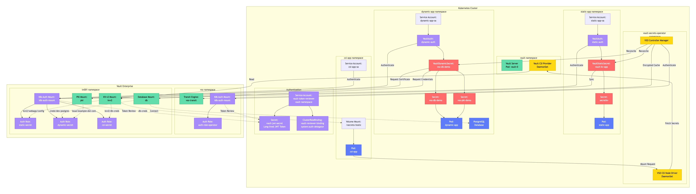

# Architecture Documentation

## Overview

This document provides a comprehensive architectural overview of the Vault Secrets Operator (VSO) integration with Kubernetes, covering deployment patterns, authentication flows, and component interactions across Minikube, Amazon EKS, and Google GKE platforms.



## System Architecture

### High-Level Architecture

```
┌────────────────────────────────────────────────────────────────┐
│                     Kubernetes Cluster                         │
│                                                                │
│  ┌──────────────┐         ┌─────────────────────────────────┐  │
│  │   Vault      │         │  Vault Secrets Operator (VSO)   │  │
│  │  Enterprise  │◄────────┤      Controller                 │  │
│  │              │         │                                 │  │
│  │  Namespaces: │         │  - Watches CRDs                 │  │
│  │  - vso       │         │  - Syncs secrets                │  │
│  │  - tn001     │         │  - Manages auth                 │  │
│  └──────────────┘         └─────────────────────────────────┘  │
│         │                              │                       │
│         │                              │                       │
│  ┌──────▼──────────────────────────────▼────────────────────┐  │
│  │           Application Namespaces                         │  │
│  │                                                          │  │
│  │  ┌─────────────┐  ┌──────────────┐  ┌──────────────┐     │  │
│  │  │ static-app-*│  │ dynamic-app  │  │   csi-app    │     │  │
│  │  │             │  │              │  │              │     │  │
│  │  │ VaultAuth   │  │  VaultAuth   │  │  VaultAuth   │     │  │
│  │  │ VaultStatic │  │  VaultDynamic│  │  CSI Volume  │     │  │
│  │  │ Secret      │  │  Secret      │  │  Mount       │     │  │
│  │  └─────────────┘  └──────────────┘  └──────────────┘     │  │
│  └──────────────────────────────────────────────────────────┘  │
└────────────────────────────────────────────────────────────────┘
```

## Component Architecture

### Vault Enterprise Components

#### Namespaces
- **vso**: VSO-specific configuration and transit encryption
  - Transit engine: `vso-transit`
  - Encryption key: `vso-client-cache`
  - Auth role: `auth-role-operator`

- **tn001**: Tenant namespace for application secrets
  - KV v2 mount: `kvv2`
  - Database mount: `db`
  - PKI mount: `pki`
  - Kubernetes auth mount: `k8s-auth-mount`

#### Secret Engines

**KV v2 (Key-Value)**
- Mount path: `kvv2`
- Namespace: `tn001`
- Paths:
  - `kvv2/webapp/config` - Static application secrets
  - `kvv2/db-creds` - CSI driver secrets

**Database Engine**
- Mount path: `db`
- Namespace: `tn001`
- Role: `dev-postgres`
- Connection: PostgreSQL in `dynamic-app` namespace
- TTL: 1 hour (default)
- Max TTL: 24 hours

**PKI Engine**
- Mount path: `pki`
- Namespace: `tn001`
- Role: `example-dot-com`
- Allowed domains: `*.example.com`
- TTL: 24 hours
- Max TTL: 720 hours (30 days)

**Transit Engine**
- Mount path: `vso-transit`
- Namespace: `vso`
- Key: `vso-client-cache`
- Purpose: Encrypt VSO client cache data

### Vault Secrets Operator (VSO)

#### Controller Components
- **Namespace**: `vault-secrets-operator`
- **Deployment**: `vault-secrets-operator-controller-manager`
- **Replicas**: 1 (can be scaled for HA)
- **Service Account**: `vault-secrets-operator-controller-manager`

#### Custom Resource Definitions (CRDs)
1. **VaultConnection**: Defines connection to Vault server
2. **VaultAuth**: Configures authentication method
3. **VaultStaticSecret**: Syncs static KV secrets
4. **VaultDynamicSecret**: Generates dynamic credentials
5. **SecretProviderClass**: CSI driver configuration (Vault CSI Provider)

#### Reconciliation Loop
```
Watch CRDs → Authenticate to Vault → Fetch/Generate Secrets →
Sync to K8s Secrets → Update Status → Cache Results → Repeat
```

### Kubernetes Components

#### Namespaces
- `vault`: Vault server and CSI provider pods
- `vault-secrets-operator`: VSO controller
- `static-app-1`, `static-app-2`, `static-app-3`: Static secret demonstrations
- `dynamic-app`: Dynamic secret demonstrations
- `csi-app`: CSI driver integration demonstration

#### Service Accounts

**JWT Token Reviewer** (Centralized)
- Name: `vault`
- Namespace: `vault`
- ClusterRoleBinding: `vault-reviewer-binding`
- ClusterRole: `system:auth-delegator`
- Token Secret: `vault-token-secret` (long-lived)
- Purpose: Token review for all Vault Kubernetes auth mounts

**Application Service Accounts**
- `static-app-sa`: Static secret applications (namespaces: `static-app-*`)
- `dynamic-app-sa`: Dynamic secret application (namespace: `dynamic-app`)
- `csi-app-sa`: CSI driver application (namespace: `csi-app`)

## Authentication Architecture

### Centralized JWT Token Reviewer Pattern

```
┌─────────────────────────────────────────────────────────────┐
│                    Kubernetes Cluster                       │
│                                                             │
│  ┌──────────────────────────────────────────────────────┐   │
│  │  vault namespace                                     │   │
│  │  ┌────────────────────────────────────────────────┐  │   │
│  │  │  Service Account: vault                        │  │   │
│  │  │  ClusterRole: system:auth-delegator            │  │   │
│  │  │  Token Secret: vault-token-secret (long-lived) │  │   │
│  │  └────────────────────────────────────────────────┘  │   │
│  └──────────────────────────────────────────────────────┘   │
│                          │                                  │
│                          │ JWT Token for Review             │
│                          ▼                                  │
│  ┌─────────────────────────────────────────────────────┐    │
│  │              Vault (tn001 namespace)                │    │
│  │  ┌──────────────────────────────────────────────┐   │    │
│  │  │  Kubernetes Auth Mount: k8s-auth-mount       │   │    │
│  │  │  - Uses vault SA token for token review      │   │    │
│  │  │  - Validates app SA tokens                   │   │    │
│  │  └──────────────────────────────────────────────┘   │    │
│  └─────────────────────────────────────────────────────┘    │
│                          ▲                                  │
│                          │ App SA Token                     │
│                          │                                  │
│  ┌─────────────────────────────────────────────────────┐    │
│  │  Application Namespaces                             │    │
│  │  ┌───────────────────────────────────────────────┐  │    │
│  │  │  Service Accounts:                            │  │    │
│  │  │  - static-app-sa (static-app-*)               │  │    │
│  │  │  - dynamic-app-sa (dynamic-app)               │  │    │
│  │  │  - csi-app-sa (csi-app)                       │  │    │
│  │  └───────────────────────────────────────────────┘  │    │
│  └─────────────────────────────────────────────────────┘    │
└─────────────────────────────────────────────────────────────┘
```

### Authentication Flow

1. **JWT Token Reviewer Setup**
   - Service account `vault` created in `vault` namespace
   - ClusterRoleBinding grants `system:auth-delegator` permissions
   - Long-lived token stored in `vault-token-secret`
   - Token configured in Vault Kubernetes auth mount

2. **Application Authentication**
   - Application pod uses its service account token
   - VaultAuth resource references the service account
   - VSO controller authenticates using the app SA token
   - Vault validates token using JWT token reviewer

3. **Token Validation Process**
   ```
   App Pod → App SA Token → VaultAuth → VSO Controller →
   Vault K8s Auth → JWT Token Reviewer → Validation →
   Vault Token → Secret Access
   ```

### Role-Based Access Control

#### Vault Roles and Policies

**Static Secrets Role**
- Role name: `static-secret`
- Policy: `static-secret`
- Bound service accounts: `static-app-sa`
- Bound namespaces: `static-app-*` (glob pattern)
- Token TTL: 1 hour
- Permissions:
  - Read: `kvv2/data/webapp/config`
  - List: `kvv2/metadata/webapp/config`

**Dynamic Secrets Role**
- Role name: `dynamic-secret`
- Policy: `dynamic-secret`
- Bound service accounts: `dynamic-app-sa`
- Bound namespaces: `dynamic-app`
- Token TTL: 1 hour
- Permissions:
  - Read: `db/creds/dev-postgres`
  - Read: `pki/issue/example-dot-com`

**CSI Secrets Role**
- Role name: `csi-secret`
- Policy: `csi-secret`
- Bound service accounts: `csi-app-sa`
- Bound namespaces: `csi-app`
- Token TTL: 1 hour
- Permissions:
  - Read: `kvv2/data/db-creds`
  - List: `kvv2/metadata/db-creds`

**VSO Operator Role**
- Role name: `auth-role-operator`
- Policy: `vso-operator`
- Bound service accounts: `vault-secrets-operator-controller-manager`
- Bound namespaces: `vault-secrets-operator`
- Token TTL: 1 hour
- Permissions:
  - Encrypt/Decrypt: `vso-transit/encrypt/vso-client-cache`
  - Encrypt/Decrypt: `vso-transit/decrypt/vso-client-cache`

## Secret Synchronization Patterns

### Static Secrets Flow

```
┌─────────────────────────────────────────────────────────────┐
│  1. User creates VaultStaticSecret CRD                      │
│     - Specifies Vault path: kvv2/webapp/config              │
│     - References VaultAuth for authentication               │
│     - Defines destination K8s Secret name                   │
└─────────────────────────────────────────────────────────────┘
                          │
                          ▼
┌─────────────────────────────────────────────────────────────┐
│  2. VSO Controller watches VaultStaticSecret                │
│     - Detects new/updated resource                          │
│     - Reads VaultAuth configuration                         │
└─────────────────────────────────────────────────────────────┘
                          │
                          ▼
┌─────────────────────────────────────────────────────────────┐
│  3. VSO authenticates to Vault                              │
│     - Uses app service account token                        │
│     - Authenticates via k8s-auth-mount                      │
│     - Receives Vault token with static-secret policy        │
└─────────────────────────────────────────────────────────────┘
                          │
                          ▼
┌─────────────────────────────────────────────────────────────┐
│  4. VSO reads secret from Vault                             │
│     - Fetches kvv2/data/webapp/config                       │
│     - Retrieves all key-value pairs                         │
└─────────────────────────────────────────────────────────────┘
                          │
                          ▼
┌─────────────────────────────────────────────────────────────┐
│  5. VSO creates/updates Kubernetes Secret                   │
│     - Creates Secret in application namespace               │
│     - Populates with Vault secret data                      │
│     - Sets owner reference for lifecycle management         │
└─────────────────────────────────────────────────────────────┘
                          │
                          ▼
┌─────────────────────────────────────────────────────────────┐
│  6. Application pod consumes secret                         │
│     - Mounts as environment variables                       │
│     - Mounts as volume at /secrets/static                   │
└─────────────────────────────────────────────────────────────┘
```

### Dynamic Secrets Flow

```
┌─────────────────────────────────────────────────────────────┐
│  1. User creates VaultDynamicSecret CRD                     │
│     - Specifies Vault path: db/creds/dev-postgres           │
│     - Defines renewal and rotation settings                 │
└─────────────────────────────────────────────────────────────┘
                          │
                          ▼
┌─────────────────────────────────────────────────────────────┐
│  2. VSO Controller watches VaultDynamicSecret               │
│     - Detects new/updated resource                          │
│     - Reads VaultAuth configuration                         │
└─────────────────────────────────────────────────────────────┘
                          │
                          ▼
┌─────────────────────────────────────────────────────────────┐
│  3. VSO authenticates to Vault                              │
│     - Uses app service account token                        │
│     - Receives Vault token with dynamic-secret policy       │
└─────────────────────────────────────────────────────────────┘
                          │
                          ▼
┌─────────────────────────────────────────────────────────────┐
│  4. VSO requests dynamic credentials                        │
│     - Calls db/creds/dev-postgres                           │
│     - Vault generates new DB credentials                    │
│     - Credentials have TTL (default: 1 hour)                │
└─────────────────────────────────────────────────────────────┘
                          │
                          ▼
┌─────────────────────────────────────────────────────────────┐
│  5. VSO creates Kubernetes Secret                           │
│     - Stores username and password                          │
│     - Includes lease information                            │
└─────────────────────────────────────────────────────────────┘
                          │
                          ▼
┌─────────────────────────────────────────────────────────────┐
│  6. VSO manages credential lifecycle                        │
│     - Renews lease before expiration                        │
│     - Rotates credentials based on policy                   │
│     - Updates K8s Secret with new credentials               │
└─────────────────────────────────────────────────────────────┘
                          │
                          ▼
┌─────────────────────────────────────────────────────────────┐
│  7. Application pod consumes credentials                    │
│     - Mounts as volume at /secrets/dynamic/db               │
│     - Automatically gets updated credentials                │
└─────────────────────────────────────────────────────────────┘
```

### CSI Driver Flow

```
┌─────────────────────────────────────────────────────────────┐
│  1. User creates SecretProviderClass                        │
│     - Defines Vault path and parameters                     │
│     - Specifies authentication details                      │
└─────────────────────────────────────────────────────────────┘
                          │
                          ▼
┌─────────────────────────────────────────────────────────────┐
│  2. User creates Pod with CSI volume                        │
│     - References SecretProviderClass                        │
│     - Defines mount path                                    │
└─────────────────────────────────────────────────────────────┘
                          │
                          ▼
┌─────────────────────────────────────────────────────────────┐
│  3. Kubelet schedules pod                                   │
│     - Detects CSI volume requirement                        │
│     - Calls CSI node driver                                 │
└─────────────────────────────────────────────────────────────┘
                          │
                          ▼
┌─────────────────────────────────────────────────────────────┐
│  4. CSI node driver intercepts mount                        │
│     - Reads SecretProviderClass                             │
│     - Initiates Vault authentication                        │
└─────────────────────────────────────────────────────────────┘
                          │
                          ▼
┌─────────────────────────────────────────────────────────────┐
│  5. Vault CSI Provider authenticates                        │
│     - Uses pod's service account token                      │
│     - Authenticates via k8s-auth-mount                      │
└─────────────────────────────────────────────────────────────┘
                          │
                          ▼
┌─────────────────────────────────────────────────────────────┐
│  6. Vault CSI Provider fetches secrets                      │
│     - Reads from kvv2/data/db-creds                         │
│     - Formats secrets per SecretProviderClass               │
└─────────────────────────────────────────────────────────────┘
                          │
                          ▼
┌─────────────────────────────────────────────────────────────┐
│  7. CSI driver mounts secrets to pod                        │
│     - Writes secrets to tmpfs volume                        │
│     - Mounts at specified path (/secrets/static)            │
│     - No Kubernetes Secret resource created                 │
└─────────────────────────────────────────────────────────────┘
                          │
                          ▼
┌─────────────────────────────────────────────────────────────┐
│  8. Application reads secrets from filesystem               │
│     - Secrets available at mount path                       │
│     - Secrets exist only in pod memory                      │
└─────────────────────────────────────────────────────────────┘
```

## Platform-Specific Architecture

### Minikube Architecture

**Characteristics:**
- Single-node cluster
- Local storage provisioner
- Standard storage class
- Direct host networking
- Suitable for development and testing

**Storage:**
- Storage class: `standard`
- Provisioner: `k8s.io/minikube-hostpath`
- Volume type: Host path on minikube VM
- Persistence: Survives pod restarts, not cluster deletion

**Networking:**
- Service type: NodePort for external access
- Ingress: Minikube ingress addon
- DNS: CoreDNS

### Amazon EKS Architecture

**Characteristics:**
- Managed control plane
- Multi-AZ worker nodes
- AWS-integrated storage and networking
- Production-grade HA setup

**Storage:**
- Storage class: `gp2` (explicitly configured)
- Provisioner: AWS EBS CSI driver
- Volume type: EBS General Purpose SSD (gp2)
- Persistence: Independent of pod/node lifecycle
- Backup: EBS snapshots

**Networking:**
- VPC: Custom VPC with public/private subnets
- CNI: AWS VPC CNI plugin
- Service type: LoadBalancer (AWS NLB/ALB)
- Ingress: AWS Load Balancer Controller
- DNS: Route53 integration

**IAM Integration:**
- IRSA: IAM Roles for Service Accounts (optional)
- Node IAM roles for EBS CSI driver
- Cluster IAM role for EKS control plane

**High Availability:**
- Control plane: Multi-AZ (AWS managed)
- Worker nodes: Distributed across AZs
- Vault: StatefulSet with persistent volumes
- VSO: Can be scaled to multiple replicas

### Google GKE Architecture

**Characteristics:**
- Managed control plane
- Regional or zonal clusters
- GCP-integrated storage and networking
- Production-grade HA setup

**Storage:**
- Storage class: `standard-rwo` (cluster default)
- Provisioner: GCE Persistent Disk CSI driver
- Volume type: Standard persistent disk
- Persistence: Independent of pod/node lifecycle
- Backup: Persistent disk snapshots

**Networking:**
- VPC: Custom VPC with subnet
- CNI: GKE native CNI (VPC-native cluster)
- Service type: LoadBalancer (GCP Load Balancer)
- Ingress: GKE Ingress controller
- DNS: Cloud DNS integration

**IAM Integration:**
- Workload Identity: GCP IAM for service accounts (optional)
- Node service accounts for persistent disk access
- Cluster service account for GKE control plane

**High Availability:**
- Control plane: Multi-zonal (GCP managed)
- Worker nodes: Distributed across zones
- Vault: StatefulSet with persistent volumes
- VSO: Can be scaled to multiple replicas

## Performance and Scalability

### VSO Controller Performance

**Resource Requirements:**
- CPU: 100m (request), 500m (limit)
- Memory: 128Mi (request), 512Mi (limit)
- Scales horizontally with leader election

**Throughput:**
- Typical: 100-500 secret syncs/minute
- With caching: 1000+ secret syncs/minute
- Bottleneck: Vault API rate limits

### Vault Performance

**Resource Requirements:**
- CPU: 500m (request), 2000m (limit)
- Memory: 256Mi (request), 2Gi (limit)
- Storage: 10Gi persistent volume

**Throughput:**
- Typical: 1000-5000 requests/second
- With performance replication: 10000+ requests/second
- Bottleneck: Storage I/O for audit logs

### Caching Strategy

**VSO Client Cache:**
- Encrypted using Vault Transit engine
- Reduces Vault API calls by 70-90%
- TTL: Configurable (default: 5 minutes)
- Invalidation: Automatic on secret updates

**Vault Token Cache:**
- In-memory token caching
- Reduces authentication overhead
- Automatic renewal before expiration

## Data Flow Diagrams

### Static Secret Data Flow

```
┌──────────────┐
│   Vault KV   │
│   Storage    │
└──────┬───────┘
       │
       │ 1. VSO reads secret
       ▼
┌──────────────┐
│     VSO      │
│  Controller  │
└──────┬───────┘
       │
       │ 2. Creates/updates K8s Secret
       ▼
┌──────────────┐
│  Kubernetes  │
│    Secret    │
└──────┬───────┘
       │
       │ 3. Mounted to pod
       ▼
┌──────────────┐
│ Application  │
│     Pod      │
└──────────────┘
```

### Dynamic Secret Data Flow

```
┌──────────────┐
│   Vault DB   │
│    Engine    │
└──────┬───────┘
       │
       │ 1. VSO requests credentials
       ▼
┌──────────────┐     2. Generates     ┌──────────────┐
│     VSO      │◄────credentials──────│  PostgreSQL  │
│  Controller  │                      │   Database   │
└──────┬───────┘                      └──────────────┘
       │
       │ 3. Creates K8s Secret with credentials
       ▼
┌──────────────┐
│  Kubernetes  │
│    Secret    │
└──────┬───────┘
       │
       │ 4. Mounted to pod
       ▼
┌──────────────┐
│ Application  │
│     Pod      │
└──────────────┘
       │
       │ 5. Uses credentials
       ▼
┌──────────────┐
│  PostgreSQL  │
│   Database   │
└──────────────┘
```

### CSI Secret Data Flow

```
┌──────────────┐
│   Vault KV   │
│   Storage    │
└──────┬───────┘
       │
       │ 1. CSI Provider reads secret
       ▼
┌──────────────┐
│  Vault CSI   │
│   Provider   │
└──────┬───────┘
       │
       │ 2. Writes to tmpfs
       ▼
┌──────────────┐
│   tmpfs      │
│   Volume     │
└──────┬───────┘
       │
       │ 3. Mounted to pod
       ▼
┌──────────────┐
│ Application  │
│     Pod      │
└──────────────┘
```

## References

- [Vault Architecture](https://developer.hashicorp.com/vault/docs/internals/architecture)
- [VSO Architecture](https://developer.hashicorp.com/vault/docs/platform/k8s/vso/architecture)
- [Kubernetes Auth Method](https://developer.hashicorp.com/vault/docs/auth/kubernetes)
- [CSI Driver Architecture](https://kubernetes-csi.github.io/docs/)
