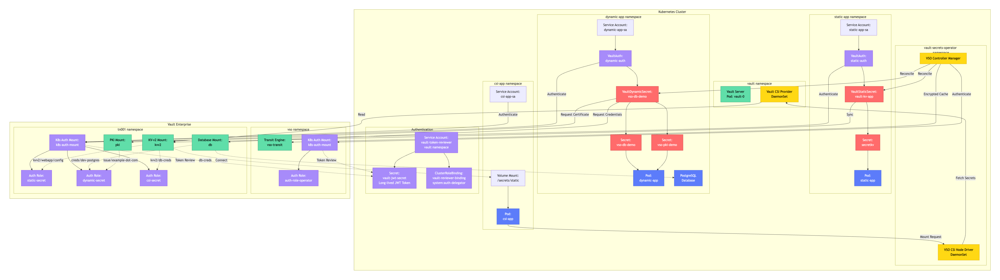

# Architecture

How Vault Enterprise, the Vault Secrets Operator (VSO) and the demo applications fit together.
Each example has its own walkthrough - see [Examples](#examples).



## High-level view

```
┌──────────────────────────────────────────────────────────────────────┐
│                          Kubernetes Cluster                          │
│                                                                      │
│  ┌──────────────────┐        ┌──────────────────────────────────┐    │
│  │ Vault Enterprise │◄───────┤ Vault Secrets Operator (VSO)     │    │
│  │ (vault ns)       │        │ (vault-secrets-operator ns)      │    │
│  │  namespaces:     │        │  - watches VSO custom resources  │    │
│  │  - vso           │        │  - logs in with app SA tokens    │    │
│  │  - tn001         │        │  - syncs Secrets / CSI volumes   │    │
│  └──────────────────┘        └──────────────────────────────────┘    │
│           ▲                                  │                       │
│           │ Vault Agent (direct login)       ▼                       │
│  ┌────────┴─────────────────────────────────────────────────────┐    │
│  │ Application namespaces                                       │    │
│  │  static-app-*   VaultAuth + VaultStaticSecret                │    │
│  │  dynamic-app    VaultAuth + VaultDynamicSecret/VaultPKISecret│    │
│  │  csi-app        VaultAuth + CSISecrets (CSI volume)          │    │
│  │  pki-app-*      VaultPKISecret (shared VaultAuth in VSO ns)  │    │
│  │  entity-app-*   VaultAuth + VaultStaticSecret                │    │
│  │  vault-agent-app  Vault Agent init container (optional)      │    │
│  └──────────────────────────────────────────────────────────────┘    │
└──────────────────────────────────────────────────────────────────────┘
```

## Vault

| Namespace | Mount | Type | Used by |
|---|---|---|---|
| `vso` | `k8s-auth-mount` | kubernetes (token reviewer) | VSO controller (role `auth-role-operator`) |
| `vso` | `vso-transit` | transit, key `vso-client-cache` | VSO encrypted client cache |
| `tn001` | `k8s-auth-mount` | jwt (OIDC discovery) | every demo application |
| `tn001` | `kvv2` | kv-v2 | static, CSI, entity, Vault Agent |
| `tn001` | `db` | database, role `dev-postgres` | dynamic |
| `tn001` | `pki` | pki, roles `example-dot-com` and `pki-app` | dynamic, shared PKI |

KV v2 paths in `tn001`:

- `kvv2/webapp/config` - static secrets and Vault Agent
- `kvv2/db-creds` - CSI secrets
- `kvv2/teams/<team>/config` - entity metadata, one per team in `apps.json`

## Vault Secrets Operator

- Namespace `vault-secrets-operator`, deployment and service account
  `vault-secrets-operator-controller-manager`, 1 replica.
- A default `VaultConnection` to `http://vault.vault.svc.cluster.local:8200` is created by the Helm
  chart (`vault-ent/vault-operator-values.yaml`), with the CSI driver enabled.
- Custom resources used by the demos: `VaultConnection`, `VaultAuth`, `VaultStaticSecret`,
  `VaultDynamicSecret`, `VaultPKISecret`, `CSISecrets`.

```
Watch resources → log in to Vault → read/issue secrets →
write Kubernetes Secret (or CSI volume) → update status → cache (encrypted) → repeat
```

## Kubernetes namespaces and service accounts

| Namespace | Service account | Purpose |
|---|---|---|
| `vault` | `vault` | Vault server and Vault CSI provider; `vault` SA is the token reviewer for the `vso` mount |
| `vault-secrets-operator` | `vault-secrets-operator-controller-manager` | VSO controller |
| `static-app-1..3` | `static-app-sa` (same name in each) | Static secrets |
| `dynamic-app` | `dynamic-app-sa` | Dynamic database credentials and TLS |
| `csi-app` | `csi-app-sa` | CSI secrets |
| `pki-app-1..3` | `pki-app-sa` (same name in each) | Shared PKI certificates |
| `entity-app-1..3` | `entity-app-N-sa` (unique per namespace) | Entity metadata |
| `vault-agent-app` | `vault-agent-sa` | Vault Agent sidecar (optional) |

## Authentication

Two auth mounts, both named `k8s-auth-mount`, live in different Vault namespaces:

```
 vso namespace (VSO controller only)          tn001 namespace (all demo apps)
 ┌────────────────────────────────────┐       ┌────────────────────────────────────┐
 │ kubernetes auth                    │       │ jwt auth                           │
 │ token_reviewer_jwt = vault SA token│       │ oidc_discovery_url = cluster issuer│
 │ (vault-token-secret, long-lived,   │       │ bound_issuer = cluster issuer      │
 │  system:auth-delegator)            │       │ validates tokens offline via JWKS  │
 └─────────────────▲──────────────────┘       └─────────────────▲──────────────────┘
                   │ controller SA token                        │ app SA tokens (aud: vault)
      vault-secrets-operator-controller-manager   static-app-sa, dynamic-app-sa, csi-app-sa,
                                                  pki-app-sa, entity-app-N-sa, vault-agent-sa
```

- **`vso` mount** (`task config:vso:encrypted-cache`): Kubernetes auth. Vault calls the TokenReview
  API with the long-lived `vault` SA token from `vault-token-secret`
  (ClusterRoleBinding `vault-reviewer-binding` → `system:auth-delegator`). Role
  `auth-role-operator` grants policy `vso-transit` (encrypt/decrypt on
  `vso-transit/*/vso-client-cache`), token period 1 hour.
- **`tn001` mount** (`task config:static-secret`): JWT auth. Vault fetches the cluster's OIDC
  discovery document and JWKS (`oidc-discovery-public` ClusterRoleBinding allows unauthenticated
  discovery) and validates service account tokens itself. On minikube the cluster CA is passed via
  `oidc_discovery_ca_pem`; on EKS/GKE the public issuer uses the system CA bundle.

Login flow for a demo app: VSO requests a token for the app's service account (TokenRequest,
audience `vault`) → logs in to `tn001/auth/k8s-auth-mount` with the app's role → Vault checks the
signature, issuer and bound claims → issues a Vault token with the role's policies.

### Roles and isolation

Each example has its own Vault role and policy in `tn001`, but isolation differs by design:

- **Static, shared PKI, entity**: one role serves several namespaces through glob bound claims
  (`static-app-*`, `pki-app-*`, `entity-app-*`).
- **Shared PKI**: every namespace uses the same SA name, so all log in as one alias - deliberately
  not a tenancy boundary.
- **Entity metadata**: each namespace has a unique SA name, mapped to a pre-created entity whose
  metadata attributes usage for chargeback; the templated policy also scopes reads to the entity's
  `team`.
- **Dynamic, CSI, Vault Agent**: one namespace and one service account each.

Role and policy details are in each example's walkthrough.

## Examples

| Example | Delivery mechanism | Manifests | Document |
|---|---|---|---|
| Static secrets | `VaultStaticSecret` → Kubernetes `Secret` | `vault-ent/static-secrets/` | [static-secrets.md](static-secrets.md) |
| Dynamic secrets | `VaultDynamicSecret` / `VaultPKISecret` → `Secret`, leased | `vault-ent/dynamic-secrets/` | [dynamic-secrets.md](dynamic-secrets.md) |
| CSI secrets | `CSISecrets` → pod CSI volume, no `Secret` | `vault-ent/csi-secrets/` | [csi-secrets.md](csi-secrets.md) |
| Shared PKI | One shared `VaultAuth` → `kubernetes.io/tls` `Secret` per namespace | `vault-ent/pki-secrets/` | [pki-secrets.md](pki-secrets.md) |
| Entity metadata | Pre-created entity + templated policy → `Secret` per namespace | `vault-ent/entity-secrets/` | [entity-secrets.md](entity-secrets.md) |
| Vault Agent (optional) | Agent init container → rendered file, no `Secret` | `vault-ent/vault-agent-secrets/` | [vault-agent-secrets.md](vault-agent-secrets.md) |

Cluster provisioning for EKS and GKE is covered in [cloud-deployment.md](cloud-deployment.md).

## Storage classes

`task install:vault` and `task deploy:dynamic-secret` detect the platform from the current kubectl
context and pick a storage class:

| Platform | Context contains | Vault data volume | PostgreSQL PVC |
|---|---|---|---|
| Minikube | `minikube` | cluster default (`standard`) | `standard` |
| EKS | `eks` or `arn:aws` | `gp2` (`--set server.dataStorage.storageClass=gp2`) | `gp2` |
| GKE | `gke` | cluster default (typically `standard-rwo`) | `standard-rwo` |
| Other | - | cluster default | `standard` |

`vault-ent/vault-values.yaml` sets no storage class; it is passed at Helm install time. PostgreSQL
uses `vault-ent/dynamic-secrets/postgres-deployment.yaml.tpl` with `${STORAGE_CLASS}` substituted.

## References

- [Vault Secrets Operator](https://developer.hashicorp.com/vault/docs/platform/k8s/vso)
- [Vault JWT/OIDC auth](https://developer.hashicorp.com/vault/docs/auth/jwt)
- [Vault Kubernetes auth](https://developer.hashicorp.com/vault/docs/auth/kubernetes)
- [Vault Enterprise namespaces](https://developer.hashicorp.com/vault/docs/enterprise/namespaces)
