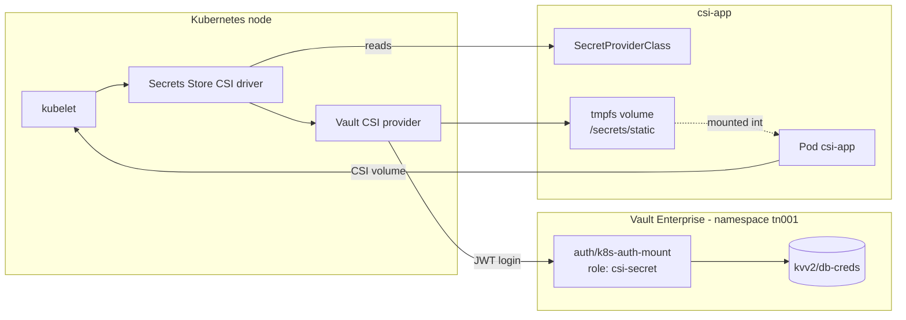

# CSI Secrets Example

Mounts secrets straight into the pod filesystem through the Secrets Store CSI driver. No Kubernetes
`Secret` object is ever created - the data exists only in the pod's tmpfs.

- Manifests: [`vault-ent/csi-secrets/`](../vault-ent/csi-secrets/)
- Tasks: `task config:csi-secret`, `task deploy:csi-secret`, `task verify:csi-secret`, `task rotate:csi:secret`, `task restart:csi-secret`
- Requires VSO installed with `csi.enabled=true`

## Architecture



Because nothing is persisted as a `Secret`, the data disappears when the pod does - at the cost of
being unavailable to anything that cannot mount the volume.

## Vault configuration

**CSI Secrets Role**
- Role name: `csi-secret`
- Policy: `csi-secret`
- Bound service accounts: `csi-app-sa`
- Bound namespaces: `csi-app`
- Token TTL: 1 hour
- Permissions:
  - Read: `kvv2/data/db-creds`
  - List: `kvv2/metadata/db-creds`

## Synchronisation flow

```
┌─────────────────────────────────────────────────────────────┐
│  1. User creates SecretProviderClass                        │
│     - Defines Vault path and parameters                     │
│     - Specifies authentication details                      │
└─────────────────────────────────────────────────────────────┘
                          │
                          ▼
┌─────────────────────────────────────────────────────────────┐
│  2. User creates Pod with CSI volume                        │
│     - References SecretProviderClass                        │
│     - Defines mount path                                    │
└─────────────────────────────────────────────────────────────┘
                          │
                          ▼
┌─────────────────────────────────────────────────────────────┐
│  3. Kubelet schedules pod                                   │
│     - Detects CSI volume requirement                        │
│     - Calls CSI node driver                                 │
└─────────────────────────────────────────────────────────────┘
                          │
                          ▼
┌─────────────────────────────────────────────────────────────┐
│  4. CSI node driver intercepts mount                        │
│     - Reads SecretProviderClass                             │
│     - Initiates Vault authentication                        │
└─────────────────────────────────────────────────────────────┘
                          │
                          ▼
┌─────────────────────────────────────────────────────────────┐
│  5. Vault CSI Provider authenticates                        │
│     - Uses pod's service account token                      │
│     - Authenticates via k8s-auth-mount                      │
└─────────────────────────────────────────────────────────────┘
                          │
                          ▼
┌─────────────────────────────────────────────────────────────┐
│  6. Vault CSI Provider fetches secrets                      │
│     - Reads from kvv2/data/db-creds                         │
│     - Formats secrets per SecretProviderClass               │
└─────────────────────────────────────────────────────────────┘
                          │
                          ▼
┌─────────────────────────────────────────────────────────────┐
│  7. CSI driver mounts secrets to pod                        │
│     - Writes secrets to tmpfs volume                        │
│     - Mounts at specified path (/secrets/static)            │
│     - No Kubernetes Secret resource created                 │
└─────────────────────────────────────────────────────────────┘
                          │
                          ▼
┌─────────────────────────────────────────────────────────────┐
│  8. Application reads secrets from filesystem               │
│     - Secrets available at mount path                       │
│     - Secrets exist only in pod memory                      │
└─────────────────────────────────────────────────────────────┘
```

## Data flow

```
┌──────────────┐
│   Vault KV   │
│   Storage    │
└──────┬───────┘
       │
       │ 1. CSI Provider reads secret
       ▼
┌──────────────┐
│  Vault CSI   │
│   Provider   │
└──────┬───────┘
       │
       │ 2. Writes to tmpfs
       ▼
┌──────────────┐
│   tmpfs      │
│   Volume     │
└──────┬───────┘
       │
       │ 3. Mounted to pod
       ▼
┌──────────────┐
│ Application  │
│     Pod      │
└──────────────┘
```

## Related

- [Architecture overview](architecture.md)
- [Static secrets example](static-secrets.md) - the same KV mount, delivered as a `Secret`
- [Testing and validation](testing-validation.md)
