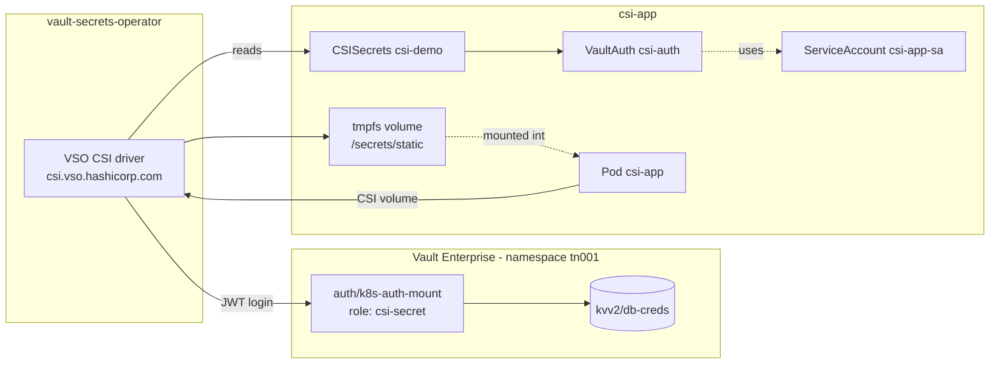

# CSI Secrets Example

Mounts secrets straight into the pod filesystem through the **VSO CSI driver**
(`csi.vso.hashicorp.com`), configured by a `CSISecrets` resource. No Kubernetes `Secret` object is
ever created: the data exists only in the pod's tmpfs volume.

- Manifests: [`vault-ent/csi-secrets/`](../vault-ent/csi-secrets/)
- Tasks: `task config:csi-secret`, `task deploy:csi-secret`, `task verify:csi-secret`, `task rotate:csi:secret`, `task restart:csi-secret`
- Requires VSO installed with `csi.enabled: true` (set in `vault-ent/vault-operator-values.yaml`)

## Architecture

Nothing is persisted as a `Secret`, so the data disappears with the pod. The trade-off is that
anything that can't mount the volume can't read the data.

## CSISecrets resource

`csi-demo` does three jobs:
- **Declares the secret:** `kvv2/db-creds`, authenticated through `VaultAuth/csi-auth`.
- **Restricts which pods may mount it:** `accessControl` checks the service account (`csi-app-sa`),
  the namespace (`csi-app`) and the pod name (`^csi-app-*`).
- **Renders the files:** every raw key is excluded, and templates produce `dbUsername` and
  `dbPassword`.

## Vault configuration

**CSI Secrets Role**
- Role name: `csi-secret` (JWT, `user_claim` = service account name)
- Policy: `csi-secret`
- Bound service account / namespace: `csi-app-sa` / `csi-app`
- Audience: `vault`; token period: 1 hour
- Permissions: read `kvv2/data/db-creds`

## Synchronisation flow

1. `task deploy:csi-secret` applies the `ServiceAccount`, `VaultAuth`, `CSISecrets` and the
   deployment.
2. The kubelet mounts the pod's CSI volume. Its `volumeAttributes` name `csi-demo` in `csi-app`.
3. The VSO CSI driver checks the pod against `accessControl`, then logs in to Vault as
   `csi-app-sa` via `k8s-auth-mount`.
4. The driver reads `kvv2/db-creds`, renders the templates and writes `dbUsername` and
   `dbPassword` to a tmpfs volume mounted at `/secrets/static`.
5. After `task rotate:csi:secret`, run `task restart:csi-secret` so new pods mount the new values.

## Related

- [Architecture overview](architecture.md)
- [Static secrets example](static-secrets.md): the same KV mount, delivered as a `Secret`
- [Troubleshooting](troubleshooting.md)
