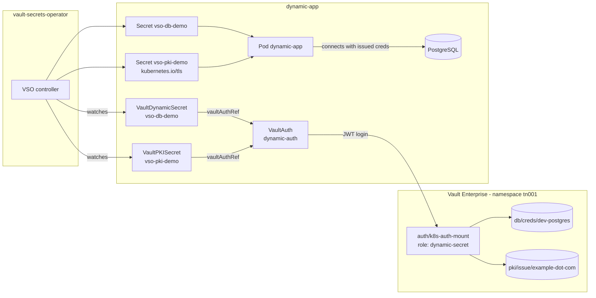

# Dynamic Secrets Example

Generates short-lived PostgreSQL credentials and an X.509 certificate on demand, so nothing
long-lived is stored in Kubernetes.

- Manifests: [`vault-ent/dynamic-secrets/`](../vault-ent/dynamic-secrets/)
- Tasks: `task config:dynamic-secret`, `task deploy:dynamic-secret`, `task verify:dynamic-secret`, `task rotate:dynamic-secret`
- Includes a PostgreSQL deployment for the database engine to issue credentials against

## Architecture



Credentials carry a lease and are revoked when it expires; the certificate is renewed by VSO before
it lapses.

## Vault configuration

**Dynamic Secrets Role**
- Role name: `dynamic-secret`
- Policy: `dynamic-secret`
- Bound service accounts: `dynamic-app-sa`
- Bound namespaces: `dynamic-app`
- Token TTL: 1 hour
- Permissions:
  - Read: `db/creds/dev-postgres`
  - Read: `pki/issue/example-dot-com`

## Synchronisation flow

```
┌─────────────────────────────────────────────────────────────┐
│  1. User creates VaultDynamicSecret CRD                     │
│     - Specifies Vault path: db/creds/dev-postgres           │
│     - Defines renewal and rotation settings                 │
└─────────────────────────────────────────────────────────────┘
                          │
                          ▼
┌─────────────────────────────────────────────────────────────┐
│  2. VSO Controller watches VaultDynamicSecret               │
│     - Detects new/updated resource                          │
│     - Reads VaultAuth configuration                         │
└─────────────────────────────────────────────────────────────┘
                          │
                          ▼
┌─────────────────────────────────────────────────────────────┐
│  3. VSO authenticates to Vault                              │
│     - Uses app service account token                        │
│     - Receives Vault token with dynamic-secret policy       │
└─────────────────────────────────────────────────────────────┘
                          │
                          ▼
┌─────────────────────────────────────────────────────────────┐
│  4. VSO requests dynamic credentials                        │
│     - Calls db/creds/dev-postgres                           │
│     - Vault generates new DB credentials                    │
│     - Credentials have TTL (default: 1 hour)                │
└─────────────────────────────────────────────────────────────┘
                          │
                          ▼
┌─────────────────────────────────────────────────────────────┐
│  5. VSO creates Kubernetes Secret                           │
│     - Stores username and password                          │
│     - Includes lease information                            │
└─────────────────────────────────────────────────────────────┘
                          │
                          ▼
┌─────────────────────────────────────────────────────────────┐
│  6. VSO manages credential lifecycle                        │
│     - Renews lease before expiration                        │
│     - Rotates credentials based on policy                   │
│     - Updates K8s Secret with new credentials               │
└─────────────────────────────────────────────────────────────┘
                          │
                          ▼
┌─────────────────────────────────────────────────────────────┐
│  7. Application pod consumes credentials                    │
│     - Mounts as volume at /secrets/dynamic/db               │
│     - Automatically gets updated credentials                │
└─────────────────────────────────────────────────────────────┘
```

## Data flow

```
┌──────────────┐
│   Vault DB   │
│    Engine    │
└──────┬───────┘
       │
       │ 1. VSO requests credentials
       ▼
┌──────────────┐     2. Generates     ┌──────────────┐
│     VSO      │◄────credentials──────│  PostgreSQL  │
│  Controller  │                      │   Database   │
└──────┬───────┘                      └──────────────┘
       │
       │ 3. Creates K8s Secret with credentials
       ▼
┌──────────────┐
│  Kubernetes  │
│    Secret    │
└──────┬───────┘
       │
       │ 4. Mounted to pod
       ▼
┌──────────────┐
│ Application  │
│     Pod      │
└──────────────┘
       │
       │ 5. Uses credentials
       ▼
┌──────────────┐
│  PostgreSQL  │
│   Database   │
└──────────────┘
```

## Related

- [Architecture overview](architecture.md)
- [Shared PKI example](pki-secrets.md) - a second role on the same `pki` mount
- [Troubleshooting](troubleshooting.md)
