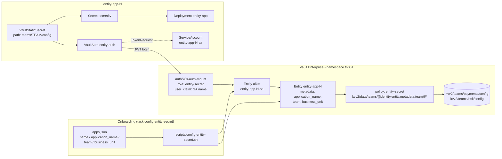

# Entity Metadata Secrets Example

Attaches business metadata (`application_name`, `team`, `business_unit`) to each workload's Vault identity by
**pre-creating identity entities**, then uses that metadata in a templated policy so each app can
read only its own team's secrets.

- Manifests: [`vault-ent/entity-secrets/`](../vault-ent/entity-secrets/)
- Onboarding catalogue: [`vault-ent/entity-secrets/apps.json`](../vault-ent/entity-secrets/apps.json)
- Script: [`scripts/config-entity-secret.sh`](../scripts/config-entity-secret.sh)
- Tasks: `task config:entity-secret`, `task deploy:entity-secret`, `task verify:entity-secret`
- Instances: one per entry in `apps.json` (default 3)

## Why not labels and `claim_mappings`?

A natural first idea is to label each `ServiceAccount` with `team` and `business-unit` and copy those
into the entity alias with the JWT role's `claim_mappings`. That does not work: the Kubernetes
TokenRequest API issues a fixed set of claims (`iss`, `sub`, `aud`, `exp`/`iat`/`nbf` and
`kubernetes.io.{namespace, serviceaccount.{name,uid}}`, plus pod/node when bound). Labels and
annotations on the `ServiceAccount` or namespace are never included, and this cannot be configured
on EKS, GKE or minikube. `claim_mappings` can only copy claims that are in the token.

So the example splits the metadata in two:

| Metadata | Source | Stored on |
|---|---|---|
| `namespace`, `service_account_name` | Token claims via `claim_mappings` | Entity **alias** (refreshed each login) |
| `application_name`, `team`, `business_unit`, `namespace` | `apps.json` via onboarding script | Pre-created **entity** |

## Architecture



## Why each app has its own service account name

The role uses `user_claim: /kubernetes.io/serviceaccount/name`, like the other labs, so the alias
name is the service account name. The alias has to be known **before** the app first logs in, and
it has to be unique per app - so each app gets a service account named `<app>-sa`
(`entity-app-1-sa`, ...), and the role binds the glob `entity-app-*-sa`.

Contrast with the [static secrets](static-secrets.md) and [shared PKI](pki-secrets.md) examples:
every namespace there uses the same service account name, so all of them log in as a single alias
(`static-app-sa`, `pki-app-sa`) and share one entity. Per-app metadata would be overwritten by
whichever app was onboarded last.

An alternative that keeps a shared service account name is `user_claim: sub`, whose value
`system:serviceaccount:<namespace>:<name>` is already unique per namespace.

Business metadata lives on the **entity**, which is what policy templates read. In the Vault UI,
open the entity's *Metadata* tab - the alias view only shows the claim-mapped values.

Keys use lowercase snake_case, matching Vault's own metadata keys (`service_account_name`, `role`)
and safe to reference as `{{identity.entity.metadata.<key>}}` in policy templates.

## Onboarding script

`scripts/config-entity-secret.sh` reads `apps.json` and, for each app:

1. Creates or updates the entity by name (`identity/entity/name/<app>`) with `application_name`,
   `team`, `business_unit` and `namespace` metadata. Metadata is replaced on every run, so `apps.json` is
   the source of truth.
2. Looks up the alias `<app>-sa` on the `k8s-auth-mount` accessor
   and then:
   - creates it pointing at the entity if it is missing;
   - **re-points** it if the app logged in before onboarding and Vault auto-created an entity
     (`entity_<uuid>`). The auto-created entity is left in place with no aliases;
   - leaves it unchanged if it is already bound.

The script is idempotent: re-running `task config:entity-secret` reports each alias as
`already bound`.

## Vault configuration

**Entity Secret Role**
- Role name: `entity-secret`
- Policy: `entity-secret`
- User claim: `/kubernetes.io/serviceaccount/name` (unique per app: `<app>-sa`)
- Bound service accounts: `entity-app-*-sa` (glob pattern)
- Bound namespaces: `entity-app-*` (glob pattern)
- Claim mappings: `/kubernetes.io/namespace` → `namespace`,
  `/kubernetes.io/serviceaccount/name` → `service_account_name`
- Token TTL: 1 hour
- Permissions:
  - Read/List/Subscribe: `kvv2/data/teams/{{identity.entity.metadata.team}}/*`

**Secrets**
- One per distinct team in `apps.json`: `kvv2/teams/<team>/config` with `team`, `username` and
  `password` keys
- Requires the `kvv2` mount and `k8s-auth-mount` created by `task config:static-secret`

## Synchronisation flow

```
┌─────────────────────────────────────────────────────────────┐
│  1. Onboarding (task config:entity-secret)                  │
│     - entity entity-app-N with application/team/BU metadata │
│     - alias entity-app-N-sa                                 │
└─────────────────────────────────────────────────────────────┘
                          │
                          ▼
┌─────────────────────────────────────────────────────────────┐
│  2. VSO logs in with the entity-app-N-sa token              │
│     - auth/k8s-auth-mount/role/entity-secret in tn001       │
│     - SA name claim matches the pre-created alias           │
│     - claim_mappings refresh the alias metadata             │
└─────────────────────────────────────────────────────────────┘
                          │
                          ▼
┌─────────────────────────────────────────────────────────────┐
│  3. Policy template resolves against the entity             │
│     - {{identity.entity.metadata.team}} → payments / risk   │
│     - only kvv2/data/teams/<own team>/* is readable         │
└─────────────────────────────────────────────────────────────┘
                          │
                          ▼
┌─────────────────────────────────────────────────────────────┐
│  4. Secret synced                                           │
│     - VaultStaticSecret path teams/<team>/config            │
│     - Kubernetes Secret secretkv, mounted at /secrets/entity│
└─────────────────────────────────────────────────────────────┘
```

## Verification

```bash
task verify:entity-secret
```

For each app, this prints the entity's metadata and aliases, the `VaultStaticSecret` status, and
the synced `team` and `username` values.

To see the policy boundary, point the `risk` app at the `payments` path:

```bash
kubectl patch vaultstaticsecret vault-kv-app -n entity-app-3 --type merge \
  -p '{"spec":{"path":"teams/payments/config"}}'
kubectl get events -n entity-app-3 --field-selector reason=VaultClientError
# Failed to read Vault secret ... Code: 403 ... permission denied
kubectl patch vaultstaticsecret vault-kv-app -n entity-app-3 --type merge \
  -p '{"spec":{"path":"teams/risk/config"}}'
```

## Trade-offs

- **Out-of-band state.** Entities live in Vault, not in Kubernetes. They must be created at
  onboarding and are **not** removed when the auth mount is disabled; `task uninstall:apps` deletes
  them by name.
- **Ordering.** If an app logs in before it is onboarded, Vault creates an entity without metadata
  and the templated policy denies access until the script re-points the alias.
- **Per-app metadata.** This is the right fit when metadata differs per app and a platform
  onboarding step owns it. If every app under one role shares the same values, role-level metadata
  is simpler.

## Related

- [Architecture overview](architecture.md)
- [Static secrets example](static-secrets.md) - same `kvv2` mount, one shared alias
- [Troubleshooting](troubleshooting.md)
