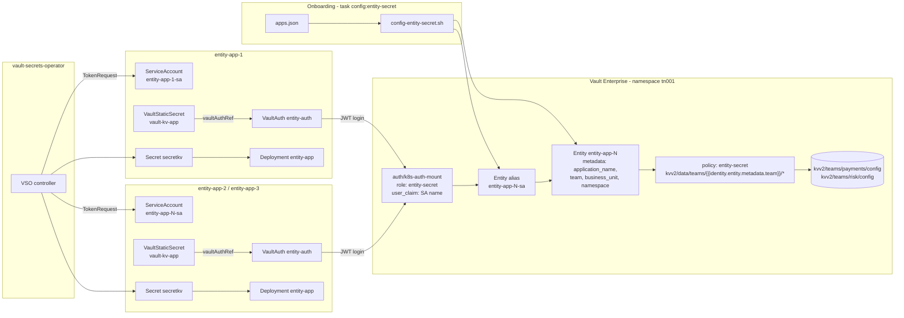

# Entity Metadata Secrets Example

Attaches business metadata (`application_name`, `team`, `business_unit`, `namespace`) to each
workload's Vault identity by **pre-creating identity entities**, so Vault usage and client counts
can be attributed to an application, team and business unit for chargeback. The example also reuses
the `team` metadata in a templated policy so each app reads only its own team's secrets.

- Manifests: [`vault-ent/entity-secrets/`](../vault-ent/entity-secrets/)
- Onboarding catalogue: [`vault-ent/entity-secrets/apps.json`](../vault-ent/entity-secrets/apps.json)
- Script: [`scripts/config-entity-secret.sh`](../scripts/config-entity-secret.sh)
- Tasks: `task config:entity-secret`, `task deploy:entity-secret`, `task verify:entity-secret`,
  `task list:identity-entities`
- Instances: one per entry in the catalogue set by the `entity_apps_file` variable (default 3)

## Architecture



`task config:entity-secret` creates the app namespaces, seeds one KV secret per team, writes the
policy and role, and runs the onboarding script. Like the static example, each namespace gets its
own `VaultAuth`; unlike it, each namespace also gets its own service account name, and so its own
entity.

## Why not labels and `claim_mappings`?

A natural first idea is to label each `ServiceAccount` with `team` and `business_unit` and copy those
into the entity alias with the JWT role's `claim_mappings`. That does not work: the Kubernetes
TokenRequest API issues a fixed set of claims (`iss`, `sub`, `aud`, `exp`/`iat`/`nbf` and
`kubernetes.io.{namespace, serviceaccount.{name,uid}}`, plus pod/node when bound). Labels and
annotations are never included, and this cannot be configured on EKS, GKE or minikube.

So the example splits the metadata in two:

| Metadata | Source | Stored on |
|---|---|---|
| `namespace`, `service_account_name` | Token claims via `claim_mappings` | Entity **alias** (refreshed each login) |
| `application_name`, `team`, `business_unit`, `namespace` | `apps.json` via onboarding script | Pre-created **entity** |

Policy templates read the **entity** metadata. In the Vault UI, open the entity's *Metadata* tab -
the alias view only shows the claim-mapped values. Keys use lowercase snake_case so they are safe to
reference as `{{identity.entity.metadata.<key>}}`.

## Why each app has its own service account name

The role uses `user_claim: /kubernetes.io/serviceaccount/name`, like the other labs, so the alias
name is the service account name. The alias must be known **before** the app first logs in and must
be unique per app - so each app gets a service account named `<app>-sa` (`entity-app-1-sa`, ...),
and the role binds the glob `entity-app-*-sa`.

This is the opposite of the [shared PKI](pki-secrets.md#why-the-service-account-is-shared) and
[static secrets](static-secrets.md) examples, where every namespace uses the same service account
name, logs in as a single alias and shares one entity - per-app metadata would be overwritten by
whichever app was onboarded last. An alternative that keeps a shared name is `user_claim: /sub`
(the role sets `user_claim_json_pointer`), whose value `system:serviceaccount:<namespace>:<name>`
is already unique per namespace.

## Onboarding script

`scripts/config-entity-secret.sh` reads `apps.json` and, for each app:

1. Creates or updates the entity `identity/entity/name/<app>` with `application_name`, `team`,
   `business_unit` and `namespace` metadata, replacing any previous metadata.
2. Looks up the alias `<app>-sa` on the `k8s-auth-mount` accessor, then:
   - creates it pointing at the entity if it is missing;
   - **re-points** it if the app logged in before onboarding and Vault auto-created an entity
     (named `entity_…`). The auto-created entity is left in place with no aliases;
   - leaves it unchanged if it is already bound.

Re-running `task config:entity-secret` reports each alias as `already bound`, but also writes a new
version of each team's KV secret, which `instantUpdates` pushes to the pods.

## Vault configuration

**Entity Secret Role**
- Role name: `entity-secret`
- Policy: `entity-secret`
- User claim: `/kubernetes.io/serviceaccount/name` (unique per app: `<app>-sa`)
- Bound service accounts: `entity-app-*-sa` (glob pattern)
- Bound namespaces: `entity-app-*` (glob pattern)
- Claim mappings: `/kubernetes.io/namespace` → `namespace`,
  `/kubernetes.io/serviceaccount/name` → `service_account_name`
- Audience: `vault`
- Token period: 1 hour
- Permissions:
  - Read/List/Subscribe (`kv*` events): `kvv2/data/teams/{{identity.entity.metadata.team}}/*`
  - Read: `sys/events/subscribe/kv*` (for `instantUpdates`)

**Secrets**
- One per distinct team in `apps.json`: `kvv2/teams/<team>/config` with `team`, `username` and
  `password` keys
- Requires the `kvv2` mount and `k8s-auth-mount` created by `task config:static-secret`

## Synchronisation flow

```
┌─────────────────────────────────────────────────────────────┐
│  1. Onboarding (task config:entity-secret)                  │
│     - entity entity-app-N with application_name, team,      │
│       business_unit and namespace metadata                  │
│     - alias entity-app-N-sa                                 │
└─────────────────────────────────────────────────────────────┘
                          │
                          ▼
┌─────────────────────────────────────────────────────────────┐
│  2. VSO logs in with the entity-app-N-sa token              │
│     - auth/k8s-auth-mount/role/entity-secret in tn001       │
│     - SA name claim matches the pre-created alias           │
│     - claim_mappings refresh the alias metadata             │
└─────────────────────────────────────────────────────────────┘
                          │
                          ▼
┌─────────────────────────────────────────────────────────────┐
│  3. Policy template resolves against the entity             │
│     - {{identity.entity.metadata.team}} → payments / risk   │
│     - only kvv2/data/teams/<own team>/* is readable         │
└─────────────────────────────────────────────────────────────┘
                          │
                          ▼
┌─────────────────────────────────────────────────────────────┐
│  4. Secret synced and consumed                              │
│     - VaultStaticSecret path teams/<team>/config            │
│     - Kubernetes Secret secretkv                            │
│     - pod reads TEAM/USERNAME/PASSWORD env vars and the     │
│       volume mounted at /secrets/entity                     │
└─────────────────────────────────────────────────────────────┘
```

## Verification

```bash
task verify:entity-secret     # entity metadata and aliases, VSS status, synced team/username
task list:identity-entities   # every entity in tn001, including auto-created entity_… ones
```

To see the policy boundary, point the `risk` app at the `payments` path, then revert:

```bash
kubectl patch vaultstaticsecret vault-kv-app -n entity-app-3 --type merge \
  -p '{"spec":{"path":"teams/payments/config"}}'
kubectl get events -n entity-app-3 --field-selector reason=VaultClientError
# Failed to read Vault secret ... Code: 403 ... permission denied
kubectl patch vaultstaticsecret vault-kv-app -n entity-app-3 --type merge \
  -p '{"spec":{"path":"teams/risk/config"}}'
task verify:entity-secret     # entity-app-3 syncs team risk again
```

## Trade-offs

- **Out-of-band state.** Entities live in Vault, not Kubernetes, and survive `vault auth disable`.
  `task uninstall:apps` deletes only the entities named in the current `apps.json`; auto-created
  `entity_…` entities, entities of apps removed from the catalogue, the `kvv2/teams/*` secrets and
  the `entity-secret` policy are left behind.
- **Ordering.** If an app logs in before it is onboarded, Vault creates an entity without metadata
  and the templated policy denies access. After the script re-points the alias, VSO likely needs to
  log in again (restart the pod or re-apply `entity-auth`), since a token's entity is fixed at login.
- **Per-app metadata.** This fits when metadata differs per app and a platform onboarding step owns
  it. If every app under one role shares the same values, the role's `alias_metadata` is simpler,
  with the policy templated on `{{identity.entity.aliases.<accessor>.metadata.<key>}}` instead.

## Related

- [Architecture overview](architecture.md)
- [Static secrets example](static-secrets.md) - same `kvv2` mount, one shared alias
- [Shared PKI example](pki-secrets.md) - one shared service account name by design
- [Troubleshooting](troubleshooting.md)
