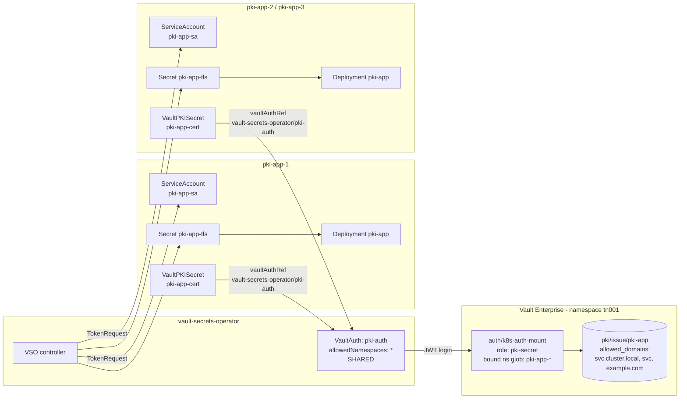

# Shared PKI Secrets Example

Issues a TLS certificate per namespace from a **single** shared service account identity - one
`VaultAuth`, one Vault auth role and one PKI issuing role serving every `pki-app-*` namespace.

- Manifests: [`vault-ent/pki-secrets/`](../vault-ent/pki-secrets/)
- Tasks: `task config:pki-secret`, `task deploy:pki-secret`, `task verify:pki-secret`, `task rotate:pki-secret`
- Instances: controlled by the `pki_app_count` variable (default 3)

## Architecture



Contrast with the other examples: they stamp out a `VaultAuth` per namespace, this one does not.
The only per-namespace objects are the `ServiceAccount`, the `VaultPKISecret` and the `Deployment`.

## Why the service account is shared

Sharing one service account *name* is scoped to the PKI use case. It keeps the Vault client
configuration simple and reduces onboarding friction: adding a namespace needs only a
`ServiceAccount` and a `VaultPKISecret`, with no new `VaultAuth`, Vault auth role or policy.

Three consequences matter:

1. **It is not a tenancy boundary.** All `pki-app-*` namespaces authenticate as the same Vault
   identity - a single entity alias named `pki-app-sa` - so any of them can request any name the
   issuing role allows, including another namespace's. Use cases needing per-tenant authorization
   should not share a service account this way.
2. **The service account must exist in each consuming namespace.** VSO resolves
   `spec.jwt.serviceAccount` in the namespace of the requesting resource, not the `VaultAuth`'s.
   Placing `pki-app-sa` only in `vault-secrets-operator` fails with
   `ServiceAccount "pki-app-sa" not found`.
3. **The policy grants issuance only.** `pki/revoke` is deliberately withheld, since one shared
   policy plus a serial number read from any peer's certificate would let one namespace revoke
   another's. `VaultPKISecret` therefore does not set `revoke: true`.

Two further notes: `vaultConnectionRef` is **required** on resources in the operator's own
namespace, and `allowedNamespaces` does **not** support globs - `pki-app-*` there is read as a
literal namespace name and matches nothing.

## Certificate shapes

`pki-app-3` requests a wildcard (`*.pki-app-3.svc.cluster.local`) while the others request concrete
names, so both shapes come out of the same role. Every certificate also carries a
`pki-app-N.example.com` SAN, so one `pki-app-tls` Secret could serve the pod *and* an external load
balancer. To front it with an Ingress, reference the Secret as `spec.tls[].secretName` from the
**same namespace** - which is where VSO already writes it. Nothing trusts this CA, so verification is
explicit:

```bash
kubectl exec vault-0 -n vault -- sh -c \
  "VAULT_TOKEN=$VAULT_TOKEN VAULT_NAMESPACE=tn001 vault read -field=certificate pki/cert/ca" > root.crt
curl --cacert root.crt --resolve pki-app-1.example.com:443:$(minikube ip) \
  https://pki-app-1.example.com
```

In production, in-cluster mTLS and public load-balancer termination normally want separate
certificates with different lifetimes and CAs; sharing one here is a lab convenience.

## Vault configuration

**Shared PKI Role**
- Role name: `pki-secret`
- Policy: `pki-secret`
- Bound service accounts: `pki-app-sa`
- Bound namespaces: `pki-app-*` (glob pattern)
- Token TTL: 1 hour
- Permissions:
  - Create/Update: `pki/issue/pki-app`
- Note: a single `VaultAuth` (`pki-auth`) in `vault-secrets-operator` serves every bound namespace

The `pki` mount is shared with the [dynamic secrets example](dynamic-secrets.md), which uses the
`example-dot-com` role on the same mount. Note that `task config:dynamic-secret` regenerates the root
CA unguarded, so re-running it after this demo orphans the issued certificates - `task
rotate:pki-secret` forces re-issuance from the new CA.

## Synchronisation flow

Unlike the static, dynamic and CSI demos - which each create their own `VaultAuth` per namespace -
the PKI demo uses **one** `VaultAuth`, **one** Vault auth role and **one** PKI issuing role for every
`pki-app-*` namespace.

```
┌─────────────────────────────────────────────────────────────┐
│  1. VaultPKISecret created in pki-app-N                     │
│     - vaultAuthRef: vault-secrets-operator/pki-auth         │
│     - the only per-namespace objects are the                │
│       ServiceAccount, the VaultPKISecret and the Deployment │
└─────────────────────────────────────────────────────────────┘
                          │
                          ▼
┌─────────────────────────────────────────────────────────────┐
│  2. VSO resolves the shared VaultAuth                       │
│     - allowedNamespaces: ["*"] permits the reference        │
│     - vaultConnectionRef: default (required in the          │
│       operator's own namespace)                             │
└─────────────────────────────────────────────────────────────┘
                          │
                          ▼
┌─────────────────────────────────────────────────────────────┐
│  3. VSO mints a ServiceAccount token                        │
│     - pki-app-sa is resolved in the REQUESTING namespace,   │
│       not in the VaultAuth's namespace                      │
│     - audience: vault                                       │
└─────────────────────────────────────────────────────────────┘
                          │
                          ▼
┌─────────────────────────────────────────────────────────────┐
│  4. Vault validates the login                               │
│     - auth/k8s-auth-mount/role/pki-secret in tn001          │
│     - bound_claims glob pki-app-* gates the namespace       │
└─────────────────────────────────────────────────────────────┘
                          │
                          ▼
┌─────────────────────────────────────────────────────────────┐
│  5. Certificate issued from pki/issue/pki-app               │
│     - allowed_domains gates the requested names             │
│     - policy grants issuance only, never revoke             │
└─────────────────────────────────────────────────────────────┘
                          │
                          ▼
┌─────────────────────────────────────────────────────────────┐
│  6. Secret synced and workload restarted                    │
│     - kubernetes.io/tls Secret pki-app-tls                  │
│     - mounted at /etc/tls                                   │
│     - rolloutRestartTargets restarts the Deployment         │
└─────────────────────────────────────────────────────────────┘
```

**Why the service account is shared**

Sharing one service account *name* across the app namespaces is scoped to the PKI use case. It keeps
the Vault client configuration simple and reduces onboarding friction: adding a namespace needs only a
`ServiceAccount` and a `VaultPKISecret`, with no new `VaultAuth`, Vault auth role or policy.

Three consequences are worth understanding:

1. **It is not a tenancy boundary.** All `pki-app-*` namespaces authenticate as the same Vault
   identity - a single entity alias named `pki-app-sa` on the `k8s-auth-mount` accessor - so any of
   them can request any name the issuing role allows, including another namespace's. Use cases that
   need per-tenant authorization should not share a service account this way.
2. **The service account must exist in each consuming namespace.** VSO resolves
   `spec.jwt.serviceAccount` in the namespace of the requesting resource, not in the `VaultAuth`'s
   namespace. Placing `pki-app-sa` only in `vault-secrets-operator` fails with
   `ServiceAccount "pki-app-sa" not found`.
3. **The policy grants issuance only.** `pki/revoke` is deliberately not granted, because one shared
   policy plus a serial number read from any peer's certificate would otherwise let one namespace
   revoke another's. The `VaultPKISecret` therefore does not set `revoke: true`.

**Certificate shapes**

`pki-app-3` requests a wildcard (`*.pki-app-3.svc.cluster.local`) while the others request concrete
names, so the example shows both coming out of the same role. Every certificate also carries an
`pki-app-N.example.com` SAN, so one `pki-app-tls` Secret could serve both the pod and an external load
balancer. To front it with an Ingress, reference the Secret as `spec.tls[].secretName` from the **same
namespace** - which is where VSO already writes it. Nothing trusts this CA, so verification is
explicit:

```bash
kubectl exec vault-0 -n vault -- sh -c \
  "VAULT_TOKEN=$VAULT_TOKEN VAULT_NAMESPACE=tn001 vault read -field=certificate pki/cert/ca" > root.crt
curl --cacert root.crt --resolve pki-app-1.example.com:443:$(minikube ip) \
  https://pki-app-1.example.com
```

In production, in-cluster mTLS and public load-balancer termination normally want separate
certificates with different lifetimes and CAs; sharing one here is a lab convenience.

## Related

- [Architecture overview](architecture.md)
- [Dynamic secrets example](dynamic-secrets.md) - the other role on the `pki` mount
- [Testing and validation](testing-validation.md)
- [Troubleshooting](troubleshooting.md)
