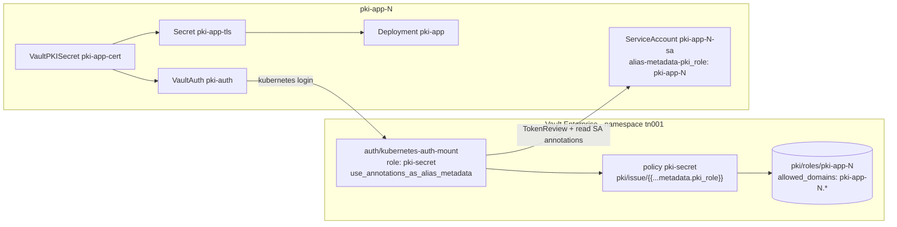

# PKI Secrets Example

Issues a TLS certificate per namespace. Each app has its own service account, and its annotations become
Vault entity alias metadata; a templated policy uses that metadata to limit each app to its own PKI role.
No entities are pre-created, unlike the [entity metadata example](entity-secrets.md).

- Manifests: [`vault-ent/pki-secrets/`](../vault-ent/pki-secrets/)
- Script: [`scripts/config-pki-secret.sh`](../scripts/config-pki-secret.sh)
- Tasks: `task config:pki-secret`, `task deploy:pki-secret`, `task verify:pki-secret`, `task rotate:pki-secret`
- Instances: controlled by the `pki_app_count` variable (default 3)

## Architecture


```mermaid
flowchart LR
  subgraph vault["Vault Enterprise - namespace tn001"]
    ROLE["auth/kubernetes-auth-mount<br/>role: pki-secret<br/>use_annotations_as_alias_metadata"]
    POL["policy pki-secret<br/>pki/issue/{{...metadata.pki_role}}"]
    PKI[("pki/roles/pki-app-N<br/>allowed_domains: pki-app-N.*")]
  end

  subgraph a["pki-app-N"]
    SA["ServiceAccount pki-app-N-sa<br/>alias-metadata-pki_role: pki-app-N"]
    VA["VaultAuth pki-auth"]
    C["VaultPKISecret pki-app-cert"]
    T["Secret pki-app-tls"]
    P["Deployment pki-app"]
  end

  C --> VA -->|kubernetes login| ROLE
  ROLE -->|TokenReview + read SA annotations| SA
  ROLE --> POL --> PKI
  C --> T --> P
```

## How it works

1. `pki-app-N-sa` carries `vault.hashicorp.com/alias-metadata-<key>` annotations: `pki_role`, `application_name`
   and `namespace` (each `pki-app-N`), plus `team: platform` and `business_unit: shared-services`. These are the
   same keys the entity example uses, and only `pki_role` is used in the policy.
2. VSO logs in to `kubernetes-auth-mount`, a **kubernetes** auth mount in `tn001`. JWT auth cannot read
   annotations, so this mount is separate from the JWT `k8s-auth-mount`. With
   `use_annotations_as_alias_metadata=true`, Vault reads the SA and copies each
   `vault.hashicorp.com/alias-metadata-<key>` annotation into the alias metadata. It reads the SA with the
   `vault-token-reviewer` token, and `vault-ent/vault-sa-reader-rbac.yaml` grants that token `get serviceaccounts`.
3. The `pki-secret` policy is written with the mount accessor filled in:
   ```hcl
   path "pki/issue/{{identity.entity.aliases.<accessor>.metadata.pki_role}}" { ... }
   ```
   So each app can only issue from its own role, and each role only allows that app's names. An SA
   without the annotation gets no access.
4. Aliases are named `<namespace>/<sa>` (`alias_name_source=serviceaccount_name`), so each app has its own
   identity. The metadata is refreshed on every login, so after changing an annotation, re-create the
   `VaultAuth` to force VSO to log in again.

Anyone who can edit ServiceAccounts in a `pki-app-*` namespace can change its annotations, so restrict that
RBAC in real clusters. The policy grants issuance only (no `pki/revoke`).

## Certificate shapes

`pki-app-3` requests a wildcard (`*.pki-app-3.svc.cluster.local`) and the others request concrete names.
Every certificate also carries a `pki-app-N.example.com` SAN, so one `pki-app-tls` Secret could serve the pod
and an Ingress in the same namespace.

The `pki` mount is shared with the [dynamic secrets example](dynamic-secrets.md) (role `example-dot-com`).
Both config tasks create the root CA only when `pki/cert/ca` is absent, so they can run in either order. To
start from a new CA, run `task uninstall:apps`, re-run the config tasks, then `task rotate:pki-secret`.

## Verification

```bash
task verify:pki-secret     # VaultAuth per namespace, certs, auth role, templated policy, pki roles
task list:identity-entities | grep -B2 -A8 pki_role   # alias metadata from the SA annotations
task rotate:pki-secret     # deletes pki-app-tls; VSO re-issues and restarts
```

A `VaultPKISecret` in `pki-app-1` that requests `role: pki-app-2` fails with `403 permission denied`.

## Related

- [Architecture overview](architecture.md)
- [Entity metadata example](entity-secrets.md) - pre-created entities instead of annotations
- [Troubleshooting](troubleshooting.md)
