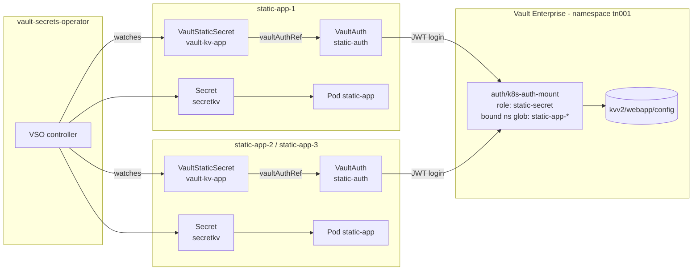

# Static Secrets Example

Syncs a KV v2 secret from Vault into a Kubernetes `Secret` in several namespaces at once, using one
Vault role with a glob-matched namespace bound claim.

- Manifests: [`vault-ent/static-secrets/`](../vault-ent/static-secrets/)
- Tasks: `task config:static-secret`, `task deploy:static-secret`, `task verify:static-secret`, `task rotate:static-secret`
- Instances: controlled by the `static_app_count` variable (default 3)

## Architecture



Each namespace gets its **own** `VaultAuth`; what is shared is the Vault role, which admits any
namespace matching `static-app-*`.

## Vault configuration

**Static Secrets Role**
- Role name: `static-secret`
- Policy: `static-secret`
- Bound service accounts: `static-app-sa`
- Bound namespaces: `static-app-*` (glob pattern)
- Token TTL: 1 hour
- Permissions:
  - Read: `kvv2/data/webapp/config`
  - List: `kvv2/metadata/webapp/config`

## Synchronisation flow

```
┌─────────────────────────────────────────────────────────────┐
│  1. User creates VaultStaticSecret CRD                      │
│     - Specifies Vault path: kvv2/webapp/config              │
│     - References VaultAuth for authentication               │
│     - Defines destination K8s Secret name                   │
└─────────────────────────────────────────────────────────────┘
                          │
                          ▼
┌─────────────────────────────────────────────────────────────┐
│  2. VSO Controller watches VaultStaticSecret                │
│     - Detects new/updated resource                          │
│     - Reads VaultAuth configuration                         │
└─────────────────────────────────────────────────────────────┘
                          │
                          ▼
┌─────────────────────────────────────────────────────────────┐
│  3. VSO authenticates to Vault                              │
│     - Uses app service account token                        │
│     - Authenticates via k8s-auth-mount                      │
│     - Receives Vault token with static-secret policy        │
└─────────────────────────────────────────────────────────────┘
                          │
                          ▼
┌─────────────────────────────────────────────────────────────┐
│  4. VSO reads secret from Vault                             │
│     - Fetches kvv2/data/webapp/config                       │
│     - Retrieves all key-value pairs                         │
└─────────────────────────────────────────────────────────────┘
                          │
                          ▼
┌─────────────────────────────────────────────────────────────┐
│  5. VSO creates/updates Kubernetes Secret                   │
│     - Creates Secret in application namespace               │
│     - Populates with Vault secret data                      │
│     - Sets owner reference for lifecycle management         │
└─────────────────────────────────────────────────────────────┘
                          │
                          ▼
┌─────────────────────────────────────────────────────────────┐
│  6. Application pod consumes secret                         │
│     - Mounts as environment variables                       │
│     - Mounts as volume at /secrets/static                   │
└─────────────────────────────────────────────────────────────┘
```

## Data flow

```
┌──────────────┐
│   Vault KV   │
│   Storage    │
└──────┬───────┘
       │
       │ 1. VSO reads secret
       ▼
┌──────────────┐
│     VSO      │
│  Controller  │
└──────┬───────┘
       │
       │ 2. Creates/updates K8s Secret
       ▼
┌──────────────┐
│  Kubernetes  │
│    Secret    │
└──────┬───────┘
       │
       │ 3. Mounted to pod
       ▼
┌──────────────┐
│ Application  │
│     Pod      │
└──────────────┘
```

## Related

- [Architecture overview](architecture.md)
- [Testing and validation](testing-validation.md)
- [Troubleshooting](troubleshooting.md)
