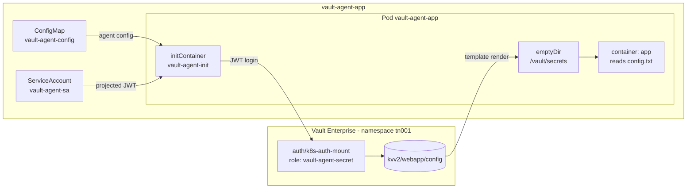

# Vault Agent Sidecar Example (Optional)

Delivers a secret as a **rendered file** rather than a Kubernetes `Secret`, using a Vault Agent init
container. No VSO custom resources are involved at all - this is the pattern to reach for when a
workload wants a config file in its own format.

- Manifests: [`vault-ent/vault-agent-secrets/`](../vault-ent/vault-agent-secrets/)
- Tasks: `task config:vault-agent-secret`, `task deploy:vault-agent-secret`, `task verify:vault-agent-secret`, `task restart:vault-agent-secret`
- **Optional**: not part of `task secrets` or `task all` - run the tasks explicitly
- Requires `task config:static-secret` first, which creates `k8s-auth-mount` and `kvv2/webapp/config`

## Architecture



The init container exits once the template is rendered; the app container then starts and reads the
file. Nothing is written to the Kubernetes API, so no `Secret` object exists to leak or RBAC.

## Vault configuration

**Vault Agent Role** (optional demo)
- Role name: `vault-agent-secret`
- Policy: `vault-agent-secret`
- Bound service accounts: `vault-agent-sa`
- Bound namespaces: `vault-agent-app`
- Permissions:
  - Read: `kvv2/data/webapp/config`

The policy is read-only on `kvv2/data/webapp/config` - the same secret the
[static secrets example](static-secrets.md) syncs, which makes the two delivery mechanisms easy to
compare side by side.

## Synchronisation flow

The other demos deliver secrets through VSO custom resources. This one uses **no VSO CRs at all** -
a Vault Agent init container authenticates and renders the secret to a shared volume, which is the
pattern to reach for when a workload wants a rendered file rather than a Kubernetes Secret.

```
┌─────────────────────────────────────────────────────────────┐
│  1. Pod starts with a vault-agent-init container            │
│     - config from the vault-agent-config ConfigMap          │
│     - projected JWT at /var/run/secrets                     │
└─────────────────────────────────────────────────────────────┘
                          │
                          ▼
┌─────────────────────────────────────────────────────────────┐
│  2. Agent authenticates to Vault                            │
│     - auth/k8s-auth-mount/role/vault-agent-secret in tn001  │
│     - service account vault-agent-sa                        │
└─────────────────────────────────────────────────────────────┘
                          │
                          ▼
┌─────────────────────────────────────────────────────────────┐
│  3. Agent renders the template                              │
│     - reads kvv2/data/webapp/config                         │
│     - writes /vault/secrets/config.txt to a shared emptyDir │
└─────────────────────────────────────────────────────────────┘
                          │
                          ▼
┌─────────────────────────────────────────────────────────────┐
│  4. Init container exits; app container starts              │
│     - reads the rendered file from the shared volume        │
│     - no Kubernetes Secret is created                       │
└─────────────────────────────────────────────────────────────┘
```

This demo is **optional** and is not part of `task secrets` or `task all`. It reads the same
`kvv2/webapp/config` secret as the Static Secrets demo, so `task config:static-secret` must have run
first to create both `k8s-auth-mount` and the KV data.

## Verifying

```bash
task verify:vault-agent-secret
```

Expect the app container to print the rendered file:

```
Contents of /vault/secrets/config.txt:

USERNAME=static-user
PASSWORD=static-password
```

and the init container logs to show `authentication successful` followed by
`rendered "(dynamic)" => "/vault/secrets/config.txt"`.

## Related

- [Architecture overview](architecture.md)
- [Static secrets example](static-secrets.md) - the same KV secret delivered as a `Secret`
- [CSI secrets example](csi-secrets.md) - another no-`Secret` delivery mechanism
